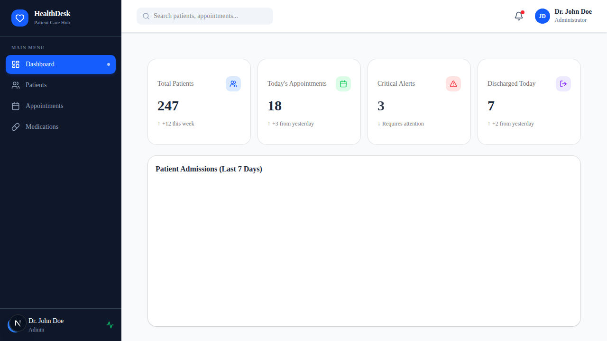
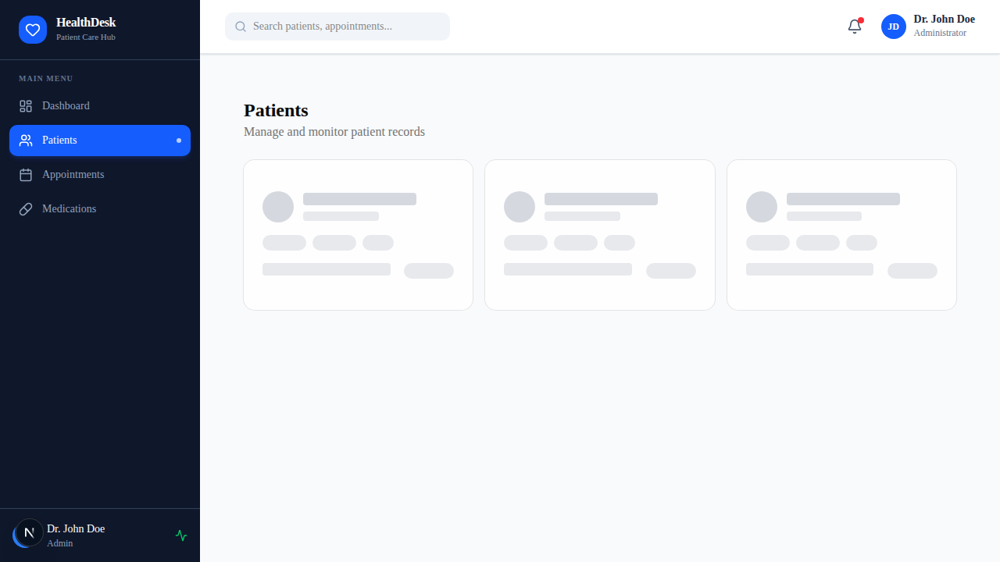
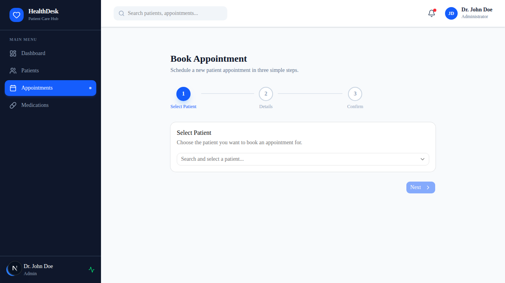
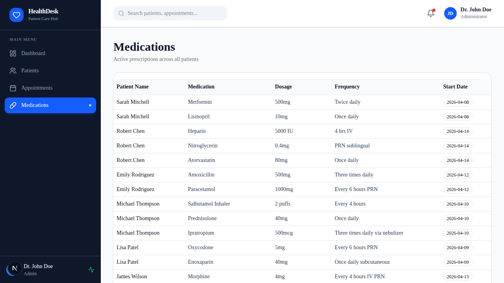

# HealthDesk — Manual Test Cases

> **Application:** HealthDesk — Patient Care Hub  
> **Version:** 0.1.0  
> **Prepared:** 2026-04-21  
> **Tester:** QA Team  

---

## Table of Contents

1. [Test Environment Setup](#1-test-environment-setup)
2. [TC-01: Dashboard — Stat Cards Display](#tc-01-dashboard--stat-cards-display)
3. [TC-02: Dashboard — Admission Trend Chart](#tc-02-dashboard--admission-trend-chart)
4. [TC-03: Sidebar Navigation](#tc-03-sidebar-navigation)
5. [TC-04: Patients — List Page Loads](#tc-04-patients--list-page-loads)
6. [TC-05: Patients — Status Badge Colors](#tc-05-patients--status-badge-colors)
7. [TC-06: Patients — Open Detail Sheet](#tc-06-patients--open-detail-sheet)
8. [TC-07: Patients — Detail Sheet: Allergies, Medications & Diagnosis History](#tc-07-patients--detail-sheet-allergies-medications--diagnosis-history)
9. [TC-08: Patients — Discharge Patient Dialog Opens](#tc-08-patients--discharge-patient-dialog-opens)
10. [TC-09: Discharge Form — Required Field Validation](#tc-09-discharge-form--required-field-validation)
11. [TC-10: Discharge Form — Successful Submission](#tc-10-discharge-form--successful-submission)
12. [TC-11: Appointments — Step 1: Select Patient](#tc-11-appointments--step-1-select-patient)
13. [TC-12: Appointments — Step 1: Next Button Disabled Without Patient](#tc-12-appointments--step-1-next-button-disabled-without-patient)
14. [TC-13: Appointments — Step 2: Select Date & Department](#tc-13-appointments--step-2-select-date--department)
15. [TC-14: Appointments — Step 2: Past Date Disabled](#tc-14-appointments--step-2-past-date-disabled)
16. [TC-15: Appointments — Step 3: Confirm Details & Book](#tc-15-appointments--step-3-confirm-details--book)
17. [TC-16: Appointments — Booking Success State](#tc-16-appointments--booking-success-state)
18. [TC-17: Appointments — Back Navigation Between Steps](#tc-17-appointments--back-navigation-between-steps)
19. [TC-18: Medications — Table Displays All Records](#tc-18-medications--table-displays-all-records)
20. [TC-19: Medications — Summary Count Accuracy](#tc-19-medications--summary-count-accuracy)
21. [TC-20: Patients — Loading Skeleton State](#tc-20-patients--loading-skeleton-state)
22. [TC-21: Patients — Error State Handling](#tc-21-patients--error-state-handling)
23. [TC-22: Responsive Layout — Mobile View](#tc-22-responsive-layout--mobile-view)

---

## 1. Test Environment Setup

| Item | Value |
|------|-------|
| Browser | Chrome 124+ / Firefox 124+ / Safari 17+ |
| Screen resolution | 1440 × 900 (desktop), 390 × 844 (mobile) |
| Base URL | `http://localhost:3456` |
| Test data | Mock data seeded in `/lib/mockData.ts` |
| Prerequisites | `npm run dev` running; no backend required |

---

## TC-01: Dashboard — Stat Cards Display

**Module:** Dashboard  
**Priority:** High  
**Screenshot:** `screenshots/01-dashboard.png`

### Pre-conditions
- Application is running at `/dashboard`.

### Test Steps

| # | Step | Expected Result |
|---|------|-----------------|
| 1 | Navigate to `http://localhost:3456/dashboard` | Page loads with title "HealthDesk — Patient Care Hub" |
| 2 | Observe the top stat cards row | 4 stat cards visible: **Total Patients**, **Today's Appointments**, **Critical Alerts**, **Discharged Today** |
| 3 | Verify "Total Patients" card | Value **247** displayed in large bold text; blue Users icon in blue-tinted box; trend arrow **↑ +12 this week** |
| 4 | Verify "Today's Appointments" card | Value **18**; green Calendar icon; trend **↑ +3 from yesterday** |
| 5 | Verify "Critical Alerts" card | Value **3** with **animate-pulse** animation; red AlertTriangle icon; trend **↓ Requires attention** |
| 6 | Verify "Discharged Today" card | Value **7**; violet LogOut icon; trend **↑ +2 from yesterday** |

### Pass Criteria
All 4 cards visible with correct values, icons, colors, and trend text.

---

## TC-02: Dashboard — Admission Trend Chart

**Module:** Dashboard  
**Priority:** Medium  
**Screenshot:** `screenshots/01-dashboard.png`

### Pre-conditions
- Dashboard page loaded.

### Test Steps

| # | Step | Expected Result |
|---|------|-----------------|
| 1 | Scroll below the stat cards | A line/bar chart titled **"Patient Admissions (Last 7 Days)"** is visible |
| 2 | Hover over any data point on the chart | Tooltip appears showing day label and admission count |
| 3 | Verify chart axes | X-axis shows 7 day labels; Y-axis shows numeric values |

### Pass Criteria
Chart renders without errors; tooltip is interactive.

---

## TC-03: Sidebar Navigation

**Module:** Navigation  
**Priority:** High  
**Screenshot:** `screenshots/01-dashboard.png`

### Pre-conditions
- Any page is open.

### Test Steps

| # | Step | Expected Result |
|---|------|-----------------|
| 1 | Observe the left sidebar | Dark slate (`bg-slate-900`) sidebar with HealthDesk logo (blue heart icon) visible |
| 2 | Verify nav items | 4 links shown: **Dashboard**, **Patients**, **Appointments**, **Medications** |
| 3 | Observe active link (Dashboard) | Active link has blue background (`bg-blue-600`), white text, and white dot indicator on right |
| 4 | Click **Patients** | URL changes to `/patients`; Patients link becomes active (blue); Dashboard becomes inactive (slate) |
| 5 | Click **Appointments** | URL changes to `/appointments`; Appointments link becomes active |
| 6 | Click **Medications** | URL changes to `/medications`; Medications link becomes active |
| 7 | Click **Dashboard** | URL changes to `/dashboard`; Dashboard link becomes active |
| 8 | Verify footer | "Dr. John Doe" with "Admin" label and green pulsing activity icon shown at bottom of sidebar |

### Pass Criteria
All nav links route correctly; active state updates on each navigation.

---

## TC-04: Patients — List Page Loads

**Module:** Patients  
**Priority:** High  
**Screenshot:** `screenshots/02-patients-list.png`

### Pre-conditions
- `/patients` page is open.

### Test Steps

| # | Step | Expected Result |
|---|------|-----------------|
| 1 | Navigate to `http://localhost:3456/patients` | Page heading **"Patients"** and subtitle **"Manage and monitor patient records"** are visible |
| 2 | Wait for data to load | Grid of patient cards appears (skeleton loader disappears) |
| 3 | Count patient cards | **12 patient cards** displayed in a responsive grid |
| 4 | Verify card content for "Sarah Mitchell" | Avatar with initials **SM** (blue background), name, doctor "Dr. James Carter", Age 54, Female, A+, condition "Type 2 Diabetes", Stable badge |
| 5 | Verify card content for "Robert Chen" | Avatar with initials **RC** (orange background for O type), condition "Acute Myocardial Infarction", **Critical** red badge |
| 6 | Hover over any card | Card slightly scales up (`hover:scale-[1.02]`) with shadow increase |

### Pass Criteria
12 patient cards load correctly with all fields populated.

---

## TC-05: Patients — Status Badge Colors

**Module:** Patients  
**Priority:** Medium  
**Screenshot:** `screenshots/02-patients-list.png`

### Pre-conditions
- Patients list page loaded.

### Test Steps

| # | Step | Expected Result |
|---|------|-----------------|
| 1 | Find a **Stable** patient (e.g., Sarah Mitchell) | Badge shows "Stable" with **green** border and text |
| 2 | Find a **Monitoring** patient (e.g., Michael Thompson — COPD) | Badge shows "Monitoring" with **amber** border and text |
| 3 | Find a **Critical** patient (e.g., Robert Chen — AMI) | Badge shows "Critical" as a **red destructive** badge |

### Pass Criteria
Each status type renders with the correct color per the design system.

---

## TC-06: Patients — Open Detail Sheet

**Module:** Patients  
**Priority:** High  
**Screenshot:** `screenshots/05-patients-detail-sheet.png`

### Pre-conditions
- Patients list page loaded.

### Test Steps

| # | Step | Expected Result |
|---|------|-----------------|
| 1 | Click on the **Sarah Mitchell** card | A right-side **Sheet** panel slides open |
| 2 | Verify sheet header | Shows patient name **"Sarah Mitchell"** and **Stable** badge |
| 3 | Verify sheet is scrollable | Scroll down in sheet; all sections are accessible |
| 4 | Click somewhere outside the sheet (overlay) | Sheet closes; patient list is visible again |
| 5 | Click on **Robert Chen** card | Sheet opens showing "Robert Chen" and **Critical** badge |

### Pass Criteria
Sheet opens/closes correctly for each patient with correct header information.

---

## TC-07: Patients — Detail Sheet: Allergies, Medications & Diagnosis History

**Module:** Patients — Detail Sheet  
**Priority:** High  

### Pre-conditions
- Sarah Mitchell's detail sheet is open.

### Test Steps

| # | Step | Expected Result |
|---|------|-----------------|
| 1 | View **Allergies** section | Shows **Penicillin** and **Sulfa drugs** as red destructive badges |
| 2 | View **Current Medications** section | Shows 2 entries: "Metformin — 500mg / Twice daily" and "Lisinopril — 10mg / Once daily"; each with pill icon |
| 3 | View **Diagnosis History** section | Shows a timeline with 2 entries; dates, diagnoses, doctor names, and notes visible |
| 4 | Open a patient with **no allergies** (e.g., Emily Rodriguez) | Allergies section shows "None known" |
| 5 | Open **Robert Chen** | Allergies: Aspirin, Ibuprofen, Latex; 3 medications listed |

### Pass Criteria
All three sections render accurately for each patient from mock data.

---

## TC-08: Patients — Discharge Patient Dialog Opens

**Module:** Patients — Discharge  
**Priority:** High  

### Pre-conditions
- Any patient detail sheet is open.

### Test Steps

| # | Step | Expected Result |
|---|------|-----------------|
| 1 | Click **"Discharge Patient"** button (blue, with LogOut icon) in sheet footer | A modal **Dialog** opens |
| 2 | Verify dialog title | Shows **"Discharge — [Patient Name]"** |
| 3 | Verify form fields visible | Discharge Date*, Discharge Notes*, Follow-up Date, Prescribing Doctor dropdown, Discharge Type dropdown |
| 4 | Click the X / close button on the dialog | Dialog closes; sheet remains open |

### Pass Criteria
Dialog opens with correct title; all form fields are visible.

---

## TC-09: Discharge Form — Required Field Validation

**Module:** Patients — Discharge Form  
**Priority:** High  

### Pre-conditions
- Discharge dialog is open.

### Test Steps

| # | Step | Expected Result |
|---|------|-----------------|
| 1 | Leave all fields empty and click **"Submit Discharge"** | Validation errors appear below required fields |
| 2 | Verify error for "Discharge Date" | Shows message **"Discharge date is required"** |
| 3 | Verify error for "Discharge Notes" | Shows message **"Discharge notes are required"** |
| 4 | Enter a discharge date and re-submit | Discharge Date error disappears; Discharge Notes error persists |
| 5 | Enter discharge notes and re-submit | All required field errors clear; form submits |

### Pass Criteria
Validation messages appear for required fields; errors clear when fields are filled.

---

## TC-10: Discharge Form — Successful Submission

**Module:** Patients — Discharge Form  
**Priority:** High  

### Pre-conditions
- Discharge dialog is open.

### Test Steps

| # | Step | Expected Result |
|---|------|-----------------|
| 1 | Enter a valid **Discharge Date** (e.g., 2026-04-21) | Date field shows selected date |
| 2 | Enter **Discharge Notes** (e.g., "Patient recovered well. Discharged to home.") | Textarea shows entered text |
| 3 | Optionally select **Prescribing Doctor** (e.g., "Dr. James Carter") | Dropdown shows selection |
| 4 | Optionally select **Discharge Type** (e.g., "Home Recovery") | Dropdown shows selection |
| 5 | Click **"Submit Discharge"** | Button shows **loading spinner** + "Submitting…" text for ~1 second |
| 6 | After 1 second | Submission completes; spinner stops; button reverts to "Submit Discharge" |

### Pass Criteria
Loading state renders during submission; form completes without errors.

---

## TC-11: Appointments — Step 1: Select Patient

**Module:** Appointments  
**Priority:** High  
**Screenshot:** `screenshots/03-appointments-step1.png`

### Pre-conditions
- Navigate to `/appointments`.

### Test Steps

| # | Step | Expected Result |
|---|------|-----------------|
| 1 | Observe the stepper | 3 steps shown: **1 (active, blue) — Select Patient**, **2 (inactive) — Details**, **3 (inactive) — Confirm** |
| 2 | Observe Step 1 card | Card titled "Select Patient" with a patient dropdown |
| 3 | Click the patient dropdown | Dropdown opens showing all 12 patients with their condition |
| 4 | Select **"Sarah Mitchell"** | Dropdown closes; a blue info box appears with "Patient Overview" showing ID, Age/Gender, Condition, Doctor |
| 5 | Verify patient overview fields | P001, 54 · Female, Type 2 Diabetes, Dr. James Carter |

### Pass Criteria
Dropdown lists all patients; selection triggers the patient overview panel.

---

## TC-12: Appointments — Step 1: Next Button Disabled Without Patient

**Module:** Appointments  
**Priority:** High  

### Pre-conditions
- Appointments page is open; no patient selected.

### Test Steps

| # | Step | Expected Result |
|---|------|-----------------|
| 1 | Observe the **Next** button without selecting a patient | Button is **disabled** (visually grayed out) |
| 2 | Attempt to click the disabled Next button | No action; step does not advance |
| 3 | Select any patient from the dropdown | **Next** button becomes **enabled** |
| 4 | Click **Next** | Advances to Step 2 |

### Pass Criteria
Next button is disabled until a patient is selected.

---

## TC-13: Appointments — Step 2: Select Date & Department

**Module:** Appointments  
**Priority:** High  

### Pre-conditions
- Step 1 completed; now on Step 2.

### Test Steps

| # | Step | Expected Result |
|---|------|-----------------|
| 1 | Observe Step 2 card | Title "Appointment Details"; date calendar and department dropdown shown |
| 2 | Observe the stepper | Step 1 shows green checkmark; Step 2 is active blue; Step 3 inactive |
| 3 | Click a future date on the calendar | Selected date is highlighted; text below calendar shows the formatted date (e.g., "Tuesday, April 22, 2026") |
| 4 | Click the **Department** dropdown | Lists 6 departments: Cardiology, Orthopedics, Neurology, Pulmonology, General Surgery, Gastroenterology |
| 5 | Select **Cardiology** | Dropdown shows "Cardiology" |
| 6 | Verify **Next** becomes enabled | Button enabled only when both date AND department are selected |

### Pass Criteria
Calendar and department dropdown work correctly; Next is enabled only with both fields.

---

## TC-14: Appointments — Step 2: Past Date Disabled

**Module:** Appointments  
**Priority:** Medium  

### Pre-conditions
- On Step 2 of appointment booking.

### Test Steps

| # | Step | Expected Result |
|---|------|-----------------|
| 1 | Observe the calendar | Dates **before today** appear visually disabled/grayed |
| 2 | Attempt to click a past date | Click has no effect; date is not selected |
| 3 | Click today's date | Today's date **can** be selected (not disabled) |

### Pass Criteria
Past dates cannot be selected; today and future dates are selectable.

---

## TC-15: Appointments — Step 3: Confirm Details & Book

**Module:** Appointments  
**Priority:** High  

### Pre-conditions
- Step 1 (patient: Sarah Mitchell) and Step 2 (date + Cardiology) completed.

### Test Steps

| # | Step | Expected Result |
|---|------|-----------------|
| 1 | Click **Next** on Step 2 | Advances to Step 3; stepper shows steps 1 & 2 with green checkmarks |
| 2 | Observe Step 3 card | Title "Confirm Appointment"; summary table with 6 rows |
| 3 | Verify summary rows | Patient: Sarah Mitchell; Patient ID: P001; Date: selected date; Department: Cardiology; Condition: Type 2 Diabetes; Assigned Doctor: Dr. James Carter |
| 4 | Verify **Book Appointment** button | Blue button (no "Next" arrow) visible at bottom right |

### Pass Criteria
All appointment details display correctly in the confirmation table.

---

## TC-16: Appointments — Booking Success State

**Module:** Appointments  
**Priority:** High  

### Pre-conditions
- On Step 3 with all details confirmed.

### Test Steps

| # | Step | Expected Result |
|---|------|-----------------|
| 1 | Click **Book Appointment** | Form cards disappear; green success card appears |
| 2 | Verify success card | Green circle with large checkmark; title **"Appointment Booked!"** |
| 3 | Verify success message | Shows "[Patient Name] has been scheduled for [Department] on [Date]" |
| 4 | Click **"Book Another Appointment"** button | Entire form resets to Step 1 with no pre-selected values |

### Pass Criteria
Success state shows correct patient/department/date; reset restores initial state.

---

## TC-17: Appointments — Back Navigation Between Steps

**Module:** Appointments  
**Priority:** Medium  

### Pre-conditions
- On Step 2 or Step 3 of appointment booking.

### Test Steps

| # | Step | Expected Result |
|---|------|-----------------|
| 1 | On Step 2, click **Back** | Returns to Step 1; previously selected patient is still selected |
| 2 | On Step 3, click **Back** | Returns to Step 2; previously selected date and department are still selected |
| 3 | On Step 1, observe navigation buttons | **Back** button is **not shown** on Step 1 |

### Pass Criteria
Back navigation preserves previously entered data; no Back button on Step 1.

---

## TC-18: Medications — Table Displays All Records

**Module:** Medications  
**Priority:** High  
**Screenshot:** `screenshots/04-medications.png`

### Pre-conditions
- Navigate to `/medications`.

### Test Steps

| # | Step | Expected Result |
|---|------|-----------------|
| 1 | Observe page header | Title **"Medications"** and subtitle **"Active prescriptions across all patients"** |
| 2 | Observe the table | 5 columns: **Patient Name**, **Medication**, **Dosage**, **Frequency**, **Start Date** |
| 3 | Verify first row | Patient: Sarah Mitchell; Medication: Metformin; Dosage: 500mg; Frequency: Twice daily |
| 4 | Verify Start Date column | Each row shows start date as an outlined **Badge** |
| 5 | Hover over a row | Row background changes to `bg-slate-50` (subtle hover effect) |

### Pass Criteria
Table renders all medication records with correct columns and data.

---

## TC-19: Medications — Summary Count Accuracy

**Module:** Medications  
**Priority:** Medium  

### Pre-conditions
- Medications page loaded.

### Test Steps

| # | Step | Expected Result |
|---|------|-----------------|
| 1 | Scroll to the bottom of the medications table | Text shows **"Total medications: N"** where N is the total count |
| 2 | Manually count table rows | Row count equals the displayed total |
| 3 | Verify count is consistent with 12 patients × avg medications | Count is a non-zero integer (typically 20+ based on mock data) |

### Pass Criteria
Displayed total matches the actual number of table rows.

---

## TC-20: Patients — Loading Skeleton State

**Module:** Patients  
**Priority:** Low  

### Pre-conditions
- Network can be throttled in browser DevTools, or observed on first load.

### Test Steps

| # | Step | Expected Result |
|---|------|-----------------|
| 1 | Open browser DevTools → Network tab → set to "Slow 3G" | Simulates slow network |
| 2 | Navigate to `/patients` | 3 skeleton cards appear with pulsing gray placeholders (avatar circle, name bar, badge bars) |
| 3 | Wait for data to load | Skeleton cards are replaced by real patient cards |

### Pass Criteria
Skeleton loader shows on slow network; replaced by real data on load.

---

## TC-21: Patients — Error State Handling

**Module:** Patients  
**Priority:** Medium  

### Pre-conditions
- API endpoint `/api/patients` can be made to fail (e.g., block in DevTools or stop the server).

### Test Steps

| # | Step | Expected Result |
|---|------|-----------------|
| 1 | Block `/api/patients` request in DevTools (Request Blocking) | After load attempt, an error card is shown |
| 2 | Verify error card | Red-bordered card with AlertTriangle icon; title "Failed to load patients"; error message shown below |
| 3 | Restore the API and refresh | Patient cards load normally |

### Pass Criteria
Error state renders with correct styling and message on API failure.

---

## TC-22: Responsive Layout — Mobile View

**Module:** All pages  
**Priority:** Medium  

### Pre-conditions
- Resize browser to **390 × 844** (iPhone 14 equivalent) or use DevTools device emulation.

### Test Steps

| # | Step | Expected Result |
|---|------|-----------------|
| 1 | Open `/dashboard` in mobile view | Stat cards display in a **2-column grid** (`grid-cols-2`) |
| 2 | Open `/patients` in mobile view | Patient cards display in **1 column** (`grid-cols-1`) |
| 3 | Open `/medications` in mobile view | Table remains visible; horizontal scroll enabled if needed |
| 4 | Open `/appointments` in mobile view | Single-column stepper and card layout; all content accessible |
| 5 | Verify sidebar visibility | Sidebar may be hidden on mobile depending on layout implementation |

### Pass Criteria
All pages are usable on mobile; no content is cut off or overlapping.

---

## Defect Reporting Template

When a test case fails, use this template to log the defect:

| Field | Value |
|-------|-------|
| **Test Case ID** | TC-XX |
| **Title** | Short description |
| **Steps to Reproduce** | Numbered steps |
| **Expected Result** | What should happen |
| **Actual Result** | What actually happened |
| **Severity** | Critical / High / Medium / Low |
| **Screenshot** | Attach screenshot |
| **Environment** | Browser, OS, screen size |

---

## Test Execution Summary Template

| TC ID | Title | Status | Tester | Date | Notes |
|-------|-------|--------|--------|------|-------|
| TC-01 | Dashboard Stat Cards | ⬜ Not Run | | | |
| TC-02 | Admission Trend Chart | ⬜ Not Run | | | |
| TC-03 | Sidebar Navigation | ⬜ Not Run | | | |
| TC-04 | Patients List Loads | ⬜ Not Run | | | |
| TC-05 | Status Badge Colors | ⬜ Not Run | | | |
| TC-06 | Patient Detail Sheet | ⬜ Not Run | | | |
| TC-07 | Sheet: Allergies, Meds, History | ⬜ Not Run | | | |
| TC-08 | Discharge Dialog Opens | ⬜ Not Run | | | |
| TC-09 | Discharge Required Validation | ⬜ Not Run | | | |
| TC-10 | Discharge Submission | ⬜ Not Run | | | |
| TC-11 | Appointment Step 1: Select | ⬜ Not Run | | | |
| TC-12 | Next Disabled Without Patient | ⬜ Not Run | | | |
| TC-13 | Appointment Step 2: Date & Dept | ⬜ Not Run | | | |
| TC-14 | Past Date Disabled | ⬜ Not Run | | | |
| TC-15 | Appointment Step 3: Confirm | ⬜ Not Run | | | |
| TC-16 | Booking Success State | ⬜ Not Run | | | |
| TC-17 | Back Navigation | ⬜ Not Run | | | |
| TC-18 | Medications Table | ⬜ Not Run | | | |
| TC-19 | Medications Count | ⬜ Not Run | | | |
| TC-20 | Loading Skeleton | ⬜ Not Run | | | |
| TC-21 | Error State | ⬜ Not Run | | | |
| TC-22 | Responsive Mobile | ⬜ Not Run | | | |

**Legend:** ⬜ Not Run &nbsp; ✅ Pass &nbsp; ❌ Fail &nbsp; ⏭️ Skipped
